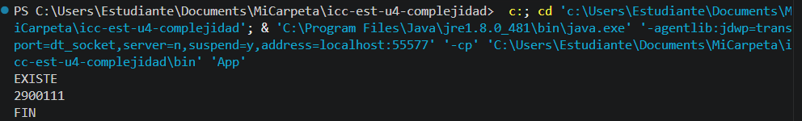

# Práctica: 04.01 Complejidad Proyecto JAVA

## Datos del Estudiante
- **Nombre:** Nataly Nicol Jiménez Salazar
- **Curso:** Grupo-6-Práctica. Segundo ciclo.
- **Fecha:** 15/04/2026

---

## 1. icc-est-u4-complejidad

**Fecha:** 14/04/2026
**Descripción:** Creamos el proyecto y subimos a GitHub

---

## 2. icc-est-u4-complejidad
![Descripción de la captura] 
**Fecha:** 15/03/26
**Descripción:** Creamos la clase Estudiante y Generados y creamos un listado de estudantes con datos aleatorios para buscar y optimizar la busqueda.
